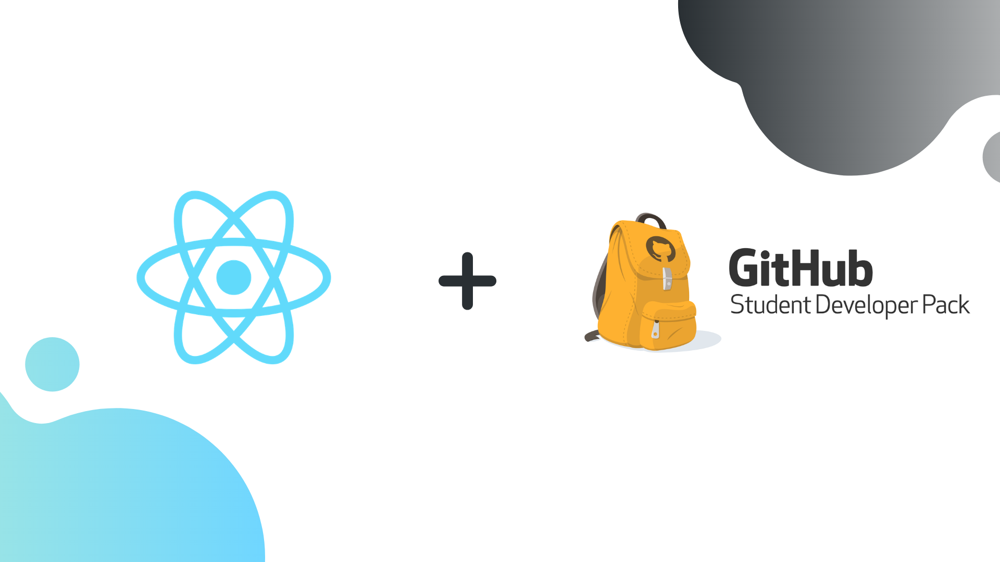
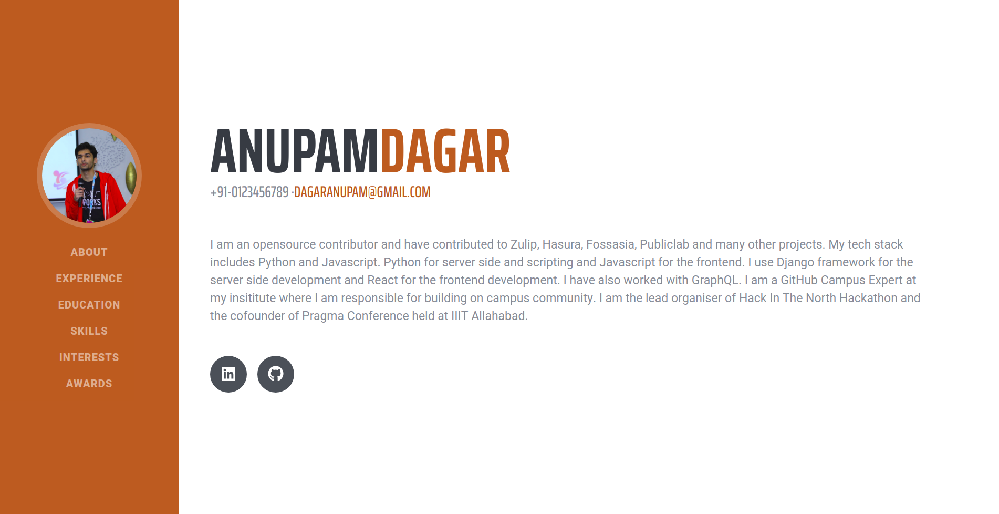

# Portfolio
## Built using React and tools from GitHub Student Developer Pack.

This is a tutorial on building a portfolio website using React and tools from the GitHub Student Developer Pack. Tools used from the **GitHub Student Developer Pack** are **Heroku**, **Namecheap** and **GitHub**.  

The hosted version of this repository is live at [http://anupamdagar.com/GitHub-Education-Portfolio](http://anupamdagar.com/GitHub-Education-Portfolio)

## Steps to run locally
1. Clone the repository using `git clone https://github.com/Anupam-dagar/GitHub-Education-Portfolio.git`
2. `cd` into the cloned repository and run `yarn`. This will install all the dependencies required for the project.
3. Run the server using `yarn start`.
4. Create your own portfolio by editing the `profileData.json` present in the `src` directory.
5. Place your image in `Assets` directory present inside `src` directory. Make sure to rename it to `profile.jpg` or else you can edit the filename in `import` statement of `Sidebar.js` Component.

## Blog Post
The detailed blog post for the tutorial is at 

This project was bootstrapped with [Create React App](https://github.com/facebook/create-react-app).  
The Bootstrap template used in this tutorial is [https://github.com/BlackrockDigital/startbootstrap-resume](https://github.com/BlackrockDigital/startbootstrap-resume)